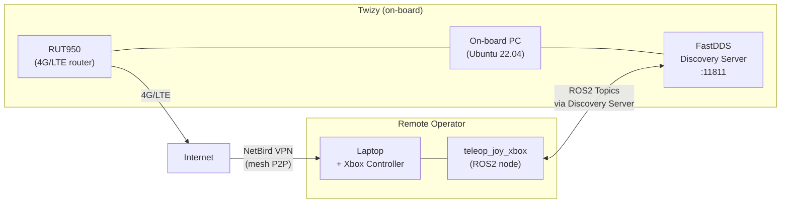

# Networking

The Twizy uses a **Teltonika RUT950** industrial 4G/LTE router as its onboard network gateway, combined with a **NetBird mesh VPN** to enable secure remote access to all ROS2 nodes from anywhere with internet connectivity.

## Architecture

## RUT950 Router

The Teltonika **RUT950** provides mobile connectivity to the vehicle.

| Spec | Value |
|------|-------|
| Technology | 4G LTE Cat 4 (up to 150 Mbps download), 3G, 2G |
| SIM | Dual SIM with automatic failover |
| WiFi | IEEE 802.11b/g/n (AP + STA) |
| Ethernet | 4 ports × 10/100 Mbps (1 WAN + 3 LAN) |
| CPU | Atheros Wasp, MIPS 74Kc, 550 MHz |
| RAM | 128 MB DDR2 |
| Storage | 16 MB Flash |
| Power | 9–30 VDC (4-pin industrial connector) |
| OS | RutOS (OpenWrt-based Linux) |
| Housing | Aluminium with plastic panels |

!!! note "Physical installation"
    The router's WiFi/config credentials are on a label on the back of the device. A 3D-printed bracket is needed to mount it in the rear of the vehicle.

!!! warning "SIM card"
    Connectivity was validated with a test SIM. A dedicated SIM plan must be purchased for production use.

## NetBird VPN

NetBird creates a peer-to-peer mesh VPN between all registered devices (vehicle PC, operator laptop, etc.), bypassing NAT and dynamic IP issues without requiring a static IP on the vehicle.

See [NetBird Setup](netbird.md) for installation and configuration.

## FastDDS Discovery Server

Because multicast does not work across NAT or VPN tunnels, ROS2 uses a **FastDDS Discovery Server** running on the vehicle as a centralized unicast discovery broker. All nodes (local and remote) register with it.

See [Discovery Server](discovery-server.md) for setup details.
