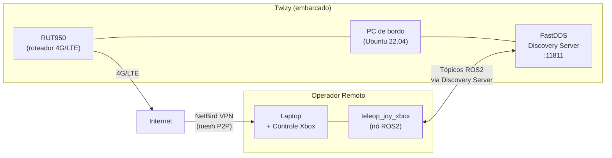

# Rede

O Twizy utiliza um roteador industrial **Teltonika RUT950** 4G/LTE como gateway de rede embarcado, combinado com uma **VPN mesh NetBird** para permitir acesso remoto seguro a todos os nós ROS2 de qualquer lugar com conexão à internet.

## Arquitetura

## Roteador RUT950

O **RUT950** da Teltonika fornece conectividade móvel ao veículo.

| Especificação | Valor |
|--------------|-------|
| Tecnologia | 4G LTE Cat 4 (até 150 Mbps download), 3G, 2G |
| SIM | Dual SIM com failover automático |
| WiFi | IEEE 802.11b/g/n (AP + STA) |
| Ethernet | 4 portas × 10/100 Mbps (1 WAN + 3 LAN) |
| CPU | Atheros Wasp, MIPS 74Kc, 550 MHz |
| RAM | 128 MB DDR2 |
| Armazenamento | 16 MB Flash |
| Alimentação | 9–30 VDC (conector industrial 4 pinos) |
| SO | RutOS (Linux baseado em OpenWrt) |
| Carcaça | Alumínio com painéis de plástico |

!!! note "Instalação física"
    As credenciais de WiFi/configuração do roteador estão em uma etiqueta na parte traseira do aparelho. É necessário modelar e imprimir em 3D uma estrutura de suporte para fixar o roteador na parte traseira do veículo.

!!! warning "Chip SIM"
    A conectividade foi validada com um chip de teste. É necessário adquirir um plano dedicado para uso em produção.

## VPN NetBird

O NetBird cria uma VPN mesh peer-to-peer entre todos os dispositivos registrados (PC do veículo, laptop do operador, etc.), contornando problemas de NAT e IP dinâmico sem exigir IP estático no veículo.

Veja [Configuração do NetBird](netbird.md) para instalação e configuração.

## FastDDS Discovery Server

Como o multicast não funciona através de NAT ou túneis VPN, o ROS2 utiliza um **FastDDS Discovery Server** rodando no veículo como broker centralizado de descoberta unicast. Todos os nós (locais e remotos) se registram nele.

Veja [Discovery Server](discovery-server.md) para detalhes de configuração.
